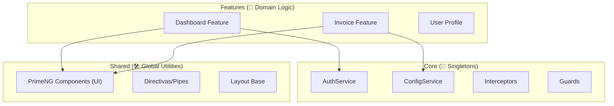
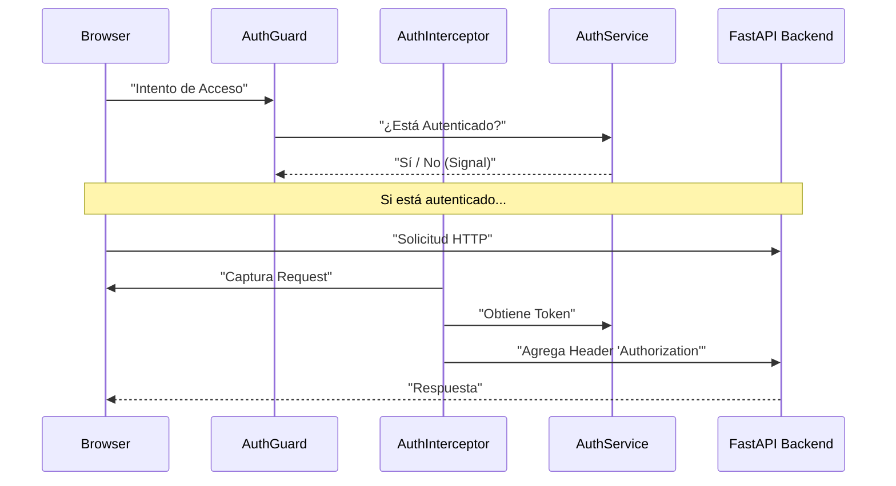
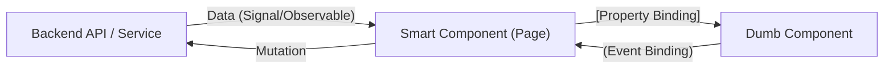

# Guía de Arquitectura y Desarrollo - Uyuni Frontend

Bienvenido al proyecto **Uyuni Frontend**. Este documento está diseñado para ayudar a los nuevos desarrolladores a entender la arquitectura, los patrones de diseño y la estructura del proyecto.

## 1. Filosofía Arquitectónica
El proyecto sigue una arquitectura basada en **Domain-Driven Design (DDD) Lite** y **Modular Monolith**, adaptada específicamente para Angular moderno (v17+).

### Principios Clave:
1.  **Separación de Responsabilidades**: Distinción clara entre lógica de negocio, presentación UI y configuración global.
2.  **Lazy Loading por Defecto**: Todos los módulos de funcionalidades (`features`) se cargan bajo demanda para optimizar el rendimiento.
3.  **Standalone Components**: No utilizamos `NgModules` (excepto para configuraciones muy específicas de librerías legacy).
4.  **Smart vs. Dumb Components**: Separación entre componentes que manejan datos/lógica (Smart) y componentes puramente visuales (Dumb).

### Visualización de Capas:



---

## 2. Estructura de Directorios (The Big Picture)

El código fuente se organiza en tres pilares fundamentales dentro de `src/app/`:

### 📂 `src/app/core` (El Cerebro 🧠)
Contiene la lógica que **debe existir una sola vez** en toda la aplicación (Singletons). NUNCA se debe importar un componente de `feature` aquí.

-   **`auth/`**: Servicios de autenticación (`AuthService`), manejo de sesión y estado de usuario.
-   **`config/`**: Configuración global de la app (`ConfigService`), carga de variables de entorno al inicio.
-   **`guards/`**: Guardas de rutas (`AuthGuard`) para proteger accesos.
-   **`interceptors/`**: Interceptores HTTP (`AuthInterceptor`) para inyectar tokens JWT.
-   **`services/`**: Servicios globales de utilidad (ej. `LayoutService`).

### Flujo de Seguridad:



### 📂 `src/app/shared` (La Caja de Herramientas 🛠️)
Contiene componentes, directivas y pipes reutilizables que **no tienen lógica de negocio específica**. Son "tontos" (Dumb Components) y se pueden usar en cualquier parte.

-   **`components/ui/`**: Base de UI basada en **PrimeNG** (Button, Dialog, Table, etc).
-   **`components/form/`**: Inputs personalizados o wrappers de PrimeNG si es necesario.
-   **`components/layout/`**: Estructuras base: `AppSidebar`, `AppHeader` (aunque son layout, son visuales).
-   **`pipe/`**: Pipes puros (ej. `SafeHtml`).

### 📂 `src/app/features` (El Negocio 💼)
Aquí reside la funcionalidad real de la aplicación, dividida por **Dominios**. Cada carpeta aquí representa una "Feature" completa y aislada.

Ejemplos: `dashboard`, `invoice`, `users`, `auth` (páginas de login).

Estructura interna OBLIGATORIA de una Feature:
-   **`pages/`**: Vistas principales (Smart Components) que se cargan por ruta.
    -   Ej: `pages/overview/invoice-overview.component.ts`.
-   **`components/`**: Componentes privados específicos de esa feature.
    -   Ej: `components/invoice-list/`.
-   **`models/`**: Interfaces y tipos de datos del dominio.
    -   *Objetivo*: Centralizar las definiciones de tipos para asegurar consistencia en todo el feature. Evitar `any`.
    -   *Ejemplo*: `Invoice.ts`, `InvoiceStatus.enum.ts`.
-   **`services/`**: Servicios HTTP específicos del dominio.
    -   *Objetivo*: Manejar la comunicación con la API para ese dominio específico. Contienen la lógica de negocio y transformación de datos.
    -   *Ejemplo*: `InvoiceService.ts` (métodos `getInvoices`, `createInvoice`).
-   **`*.routes.ts`**: Definición de rutas internas (Micro-routing).
    -   *Objetivo*: Encapsular el ruteo de la feature para permitir el Lazy Loading desde el router principal. Esto asegura que cada módulo sea autónomo y fácil de mover o conectar.

---

## 3. Patrones de Diseño Utilizados

### A. Smart vs. Dumb Components
-   **Smart (Pages)**: Ubicados en `features/<name>/pages`.
    -   Inyectan servicios (`InvoiceService`).
    -   Manejan `Observables` o `Signals`.
    -   Pasan datos a los componentes hijos vía `[input]`.
-   **Dumb (Shared/Components)**: Ubicados en `shared/components` o `features/<name>/components`.
    -   Solo reciben datos (`@Input()`).
    -   Solo emiten eventos (`@Output()`).
    -   No inyectan servicios de negocio.

### Flujo de Datos (Smart vs Dumb):



### B. Signals (Gestión de Estado)
Preferimos **Angular Signals** sobre `BehaviorSubjects` para el manejo de estado reactivo local y global (en servicios).

```typescript
// Ejemplo en AuthService
private userSignal = signal<User | null>(null);
readonly currentUser = this.userSignal.asReadonly();
```

### C. Feature Isolation (Aislamiento)
Una feature **NO debe importar** componentes privados de otra feature.
-   ❌ `import { InvoiceTable } from '../invoice/components/...'` (En Dashboard).
-   ✅ Si Dashboard necesita una tabla de facturas, el componente debe ser movido a `Shared` o duplicado si la lógica diverge.

---

## 4. Guía para Nuevos Desarrollos

### ¿Dónde creo mi nuevo código?

1.  **¿Es una página nueva?** -> Crea una carpeta en `features/<nombre-modulo>/pages/`.
2.  **¿Es un botón o input reutilizable?** -> `shared/components/ui`.
3.  **¿Es un servicio que llama a una API específica?** -> `features/<nombre-modulo>/services`.
4.  **¿Es una configuración global?** -> `core/config`.

### Flujo de creación de un nuevo Módulo (ej. "Products"):
1.  Crear `src/app/features/products`.
2.  Crear `products.routes.ts`.
3.  Crear `pages/overview/products-overview.component.ts`.
4.  Registrar la ruta lazy en `app.routes.ts`:
    ```typescript
    { path: 'products', loadChildren: () => import('./features/products/products.routes').then(m => m.routes) }
    ```
5.  Añadir enlace en `shared/layout/app-sidebar`.

---

## 5. Glosario de Carpetas

| Carpeta | Propósito | Regla de Oro |
| :--- | :--- | :--- |
| `src/app/core` | Servicios Singletons | Solo lógica, 0 UI. Importar solo en root. |
| `src/app/shared` | UI Reutilizable | Componentes tontos. Se importan donde sea. |
| `src/app/features` | Módulos de Negocio | Donde viven las pantallas. Lazy loaded. |
| `src/assets` | Recursos estáticos | Imágenes, JSONs de config, iconos. |
| `src/environments`| Variables de entorno | API URLs, flags de producción. |

---
**Generado automáticamente por Antigravity AI**

## 6. Referencias y Lectura Recomendada 📚

Para profundizar en los patrones utilizados, recomendamos las siguientes lecturas:

-   **Angular Style Guide (Oficial)**: La base de todo.
    -   [angular.io/guide/styleguide](https://angular.io/guide/styleguide)
-   **Domain-Driven Design (DDD) en Angular**: Explicación del enfoque "Modular Monolith".
    -   [Angular Architecture Patterns](https://medium.com/@tomastrajan/modular-architecture-with-angular-6-part-1-structure-services-and-components-f7caecop4)
-   **Smart vs Dumb Components**:
    -   [Presentational and Container Components](https://medium.com/@dan_abramov/smart-and-dumb-components-7ca2f9a7c7d0)
-   **Angular Signals**:
    -   [Angular Signals Guide](https://angular.io/guide/signals)
