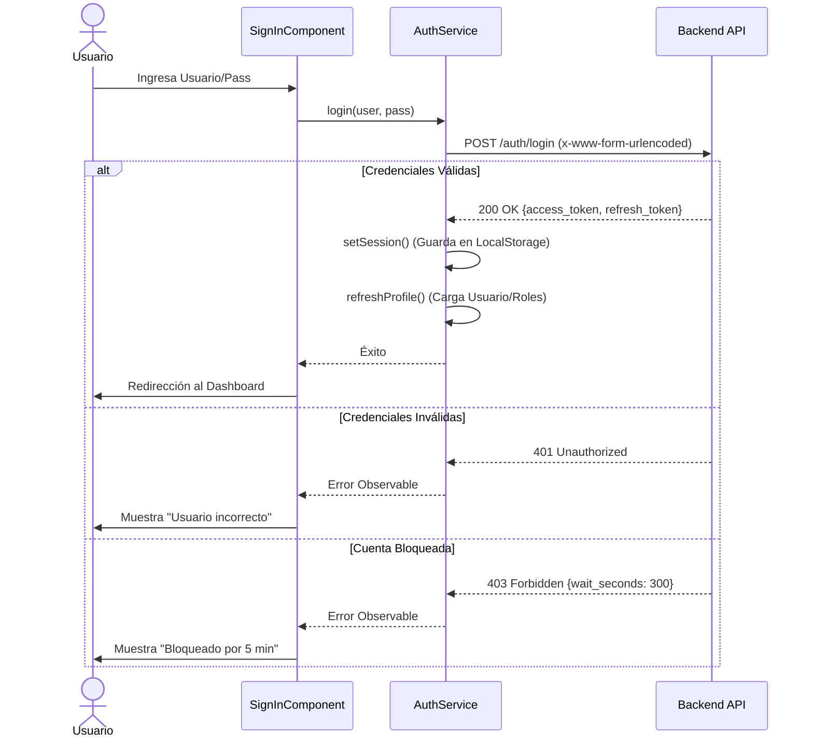
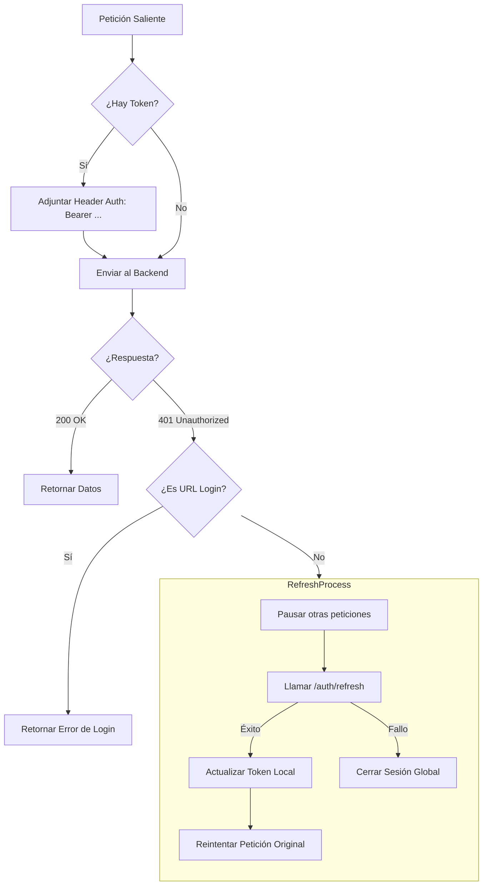

# 🔐 Documentación del Sistema de Autenticación

Este documento describe la arquitectura, flujos y decisiones técnicas del sistema de autenticación implementado en **UyuniAdmin**.

## 1. Visión General

El sistema utiliza un esquema **OAuth2 Password Grant** modificado, basado en **JWT (JSON Web Tokens)**. Está diseñado para ser robusto, seguro y tolerante a fallos de red, con una arquitectura que previene condiciones de carrera y dependencias circulares.

### Características Clave
- **Tokens**: Access Token (ej. 30 min) y Refresh Token (ej. 7 días).
- **Almacenamiento**: `localStorage` (Persistencia entre pestañas).
- **Estado**: Gestionado por **Angular Signals** (Reactividad granular).
- **Intercepción**: Manejo automático de adjunción de tokens y renovación transparente (Silent Refresh).
- **Seguridad**: Bloqueo de cuenta (403), Auto-Logout, y limpieza de estado.

---

## 2. Estructura de Archivos

Los componentes clave se encuentran distribuidos siguiendo una arquitectura modular:

```text
src/app/
├── core/
│   ├── auth/
│   │   └── auth.service.ts        # Lógica central (Login, Logout, Refresh, Profile)
│   ├── config/
│   │   └── config.service.ts      # Infraestructura (Carga config.json con HttpBackend)
│   ├── interceptors/
│   │   ├── auth.interceptor.ts    # Middleware HTTP (Token Injection y Error Handling)
│   │   └── loading.interceptor.ts # UI (Spinner global)
│   └── guards/
│       └── auth.guard.ts          # Protección de rutas
├── features/
│   └── auth/
│       └── pages/
│           ├── sign-in/           # Página de Login (Manejo de UI y Errores)
│           └── ...
└── shared/
    └── components/
        └── header/
            └── user-dropdown/     # Botón de Logout (Interacción usuario)
```

---

## 3. Diagramas de Flujo

### 3.1. Flujo de Login (Inicio de Sesión)

Cuando el usuario ingresa sus credenciales en `/signin`:



### 3.2. Flujo del AuthInterceptor (El Guardián Silencioso)

Este es el corazón del sistema. Cada petición HTTP pasa por aquí.



---

## 4. Travesía de una Petición (Paso a Paso Detallado)

A continuación, detallamos qué sucede exactamente bajo el capó cuando un token expira y se renueva automáticamente.

### Escenario: El usuario está navegando y su token ha expirado.

| Paso | Archivo / Componente | Método Ejecutado | Explicación Técnica (Por qué) |
| :--- | :--- | :--- | :--- |
| **1** | `Cualquier Componente` | `httpClient.get('/api/data')` | El usuario intenta cargar datos. Angular lanza una petición HTTP normal. |
| **2** | `auth.interceptor.ts` | `intercept(req, next)` | **Interceptación Inicial**. El interceptor ve que hay un token en `localStorage` (aunque esté vencido, él no lo sabe aún) y lo adjunta en el header `Authorization: Bearer xyz`. |
| **3** | `Backend (FastAPI)` | `verify_token` | El servidor recibe el token, verifica su firma y tiempo de expiración. Detecta que **ha expirado**. |
| **4** | `Backend (FastAPI)` | `Response 401` | El servidor rechaza la petición con un error HTTP `401 Unauthorized`. |
| **5** | `auth.interceptor.ts` | `catchError()` | **Captura del Error**. El interceptor atrapa el error 401 antes de que llegue al componente. Verifica: `¿Es la URL de login? NO`. Entonces inicia el protocolo de recuperación. |
| **6** | `auth.interceptor.ts` | `handle401Error()` | **Semáforo**. Pone `isRefreshing = true`. Si llegan otras peticiones simultáneas, las pone en cola (`refreshTokenSubject`) para no bombardear al servidor. |
| **7** | `auth.service.ts` | `refreshToken()` | **Llamada de Rescate**. Hace una petición especial POST a `/auth/refresh` enviando el `refresh_token` de larga duración. |
| **8** | `Backend (FastAPI)` | `refresh_token_endpoint` | Valida el `refresh_token`. Si es válido, genera un **nuevo** `access_token` y lo devuelve. |
| **9** | `auth.service.ts` | `tap(setSession)` | Recibe el nuevo token y actualiza inmediatamente el `localStorage` y las Signals del estado global. |
| **10** | `auth.interceptor.ts` | `switchMap()` | **Reintento**. Toma la petición original fallida (del Paso 1), le cambia el token viejo por el **nuevo token**, y la vuelve a lanzar al servidor. |
| **11** | `Cualquier Componente` | `.subscribe(data)` | El componente recibe los datos solicitados en el Paso 1. **Nunca se enteró** de que hubo un error 401 ni de que se renovó el token. Para el usuario, fue transparente. |

---

## 5. Explicación Técnica Detallada de Arquitectura

### 5.1. Configuración Robusta (`ConfigService`)

**¿Por qué es especial?**
Usamos el patrón **`HttpBackend`** en `config.service.ts`.

```typescript
constructor(private handler: HttpBackend) {
  // Creamos un HttpClient "puro" que NO usa interceptores
  this.http = new HttpClient(handler);
}
```

*   **Razón**: Si usáramos el `HttpClient` normal, este intentaría pasar por el `AuthInterceptor`. El `AuthInterceptor` necesita `AuthService`, y `AuthService` necesita `ConfigService` (para saber la URL). Esto crearía un círculo infinito (`Circular Dependency`).
*   **Solución**: Al usar `HttpBackend`, `ConfigService` es independiente de todo el sistema de autenticación. Carga primero (`APP_INITIALIZER`), y una vez listo, el resto de la app despierta.

### 5.2. Inicialización de Sesión (`AuthService`)

Resolvemos un problema sutil de concurrencia en el constructor de `auth.service.ts`:

```typescript
constructor() {
  if (this.tokenSignal()) {
    // DIFERIDO (0ms)
    setTimeout(() => this.refreshProfile(), 0);
  }
}
```

*   **Problema**: Cuando `AuthService` nace, si intenta hacer una llamada HTTP inmediata (`refreshProfile`), activaría el interceptor. El interceptor intentaría inyectar... ¡al mismo `AuthService` que todavía no terminó de nacer!
*   **Solución**: El `setTimeout` pone la llamada "al final de la cola" de ejecución (Event Loop), asegurando que el constructor termine y el servicio esté 100% listo antes de procesar la petición.

### 5.3. Reactividad con Signals

En lugar de `BehaviorSubjects` (RxJS antiguo), usamos **Signals**:

```typescript
private userSignal = signal<User | null>(null);
readonly currentUser = this.userSignal.asReadonly();
```

*   **Ventaja**: La UI se actualiza de forma granular. No necesitamos suscripciones manuales ni `async pipe` complejos en el HTML. Si `userSignal` cambia, cualquier parte de la UI que lo use se repinta automáticamente.

---

## 6. Manejo de Errores Específicos

### Bloqueo de Cuenta (API Integration)
El backend devuelve información detallada cuando se bloquea una cuenta. El frontend la captura y formatea:

- **Código**: `403 Forbidden`
- **Body**: `{ detail: { code: 'ACCOUNT_LOCKED', wait_seconds: 178, max_attempts: 5 } }`
- **Display**: "Cuenta bloqueada tras 5 intentos fallidos. Inténtalo de nuevo en 3 minutos."
