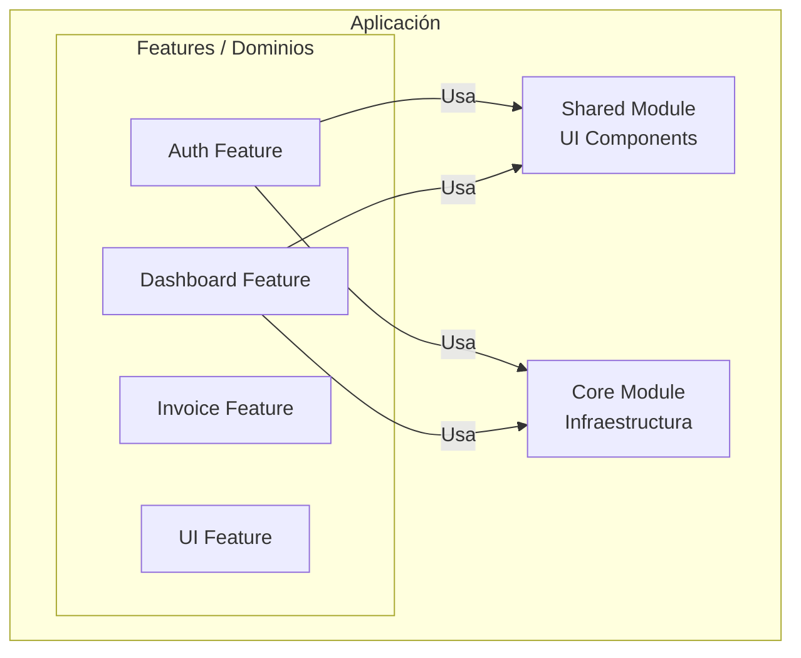
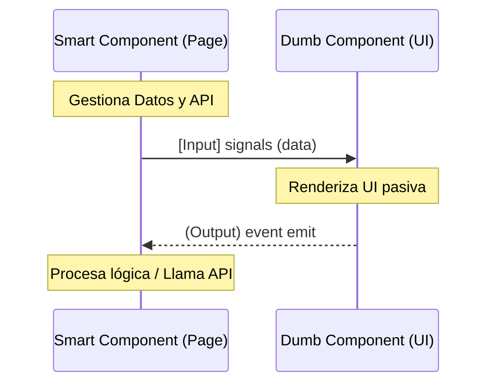
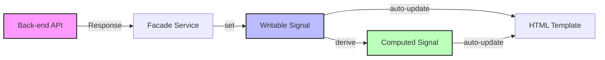

# Guía de Arquitectura Frontend Enterprise - Proyecto Uyuni

## 1. Introducción: El Estándar "Enterprise" en Frontend

Un proyecto de frontend de "**Grado Empresarial**" (Enterprise Grade) se define no por su complejidad visual, sino por su capacidad para escalar, ser mantenido por equipos grandes y perdurar en el tiempo. A diferencia de prototipos o MVPs, una aplicación Enterprise debe cumplir con pilares fundamentales:

1.  **Escalabilidad Modular**: Capacidad de agregar nuevas funcionalidades sin romper las existentes.
2.  **Mantenibilidad**: Código limpio, predecible y documentado que reduzca la deuda técnica.
3.  **Rendimiento**: Tiempos de carga rápidos y optimización de recursos (Lazy Loading).
4.  **Consistencia UI/UX**: Uso estricto de Design Systems para evitar "Frankenstein UI".
5.  **Robustez**: Manejo centralizado de errores, autenticación y tipado estricto.

Este documento analiza cómo el proyecto **Uyuni Frontend** aborda estos pilares y detalla su arquitectura técnica.

---

## 2. Análisis de Cumplimiento: Proyecto Uyuni

### ✅ Características Enterprise Implementadas

*   **Arquitectura Modular (DDD Lite)**: El proyecto no es una "sopa" de componentes. Está estructurado en **Dominios de Funcionalidad** (`features/*`), separando claramente la lógica de negocio (Dashboard, Auth, Invoice) de la infraestructura global (`core`) y la UI reutilizable (`shared`).
*   **Modern Angular (v21 + Standalone)**: Uso de las últimas características del framework que eliminan la complejidad de `NgModules` y optimizan el "Tree Shaking" para builds más ligeros.
*   **Gestión de Estado Reactivo (Signals)**: Uso de la primitiva `Signal` para el manejo de estado, ofreciendo un rendimiento superior a `Zone.js` tradicional y menor complejidad cognitiva que `Redux/NgRx` para estados locales.
*   **Sistema de Diseño Estricto**: Integración de **PrimeNG v21 + Tailwind CSS v4**. No se escriben estilos CSS arbitrarios; se utilizan tokens y librerías probadas para garantizar consistencia y accesibilidad (A11y).
*   **Lazy Loading Total**: Todas las rutas principales se cargan bajo demanda, una característica crítica para aplicaciones grandes.
*   **Arquitectura de Importación Limpia (Path Aliases)**: Uso estricto de alias (`@core`, `@shared`, `@features`) para eliminar rutas relativas profundas, cumpliendo con estándares de legibilidad y robustez estructural.
*   **Gestión Visual de Raíz (Truly Global)**: Los componentes de bloqueo de UI (Spinners) se alojan en el `AppComponent`. Esto previene estados huérfanos durante cierres de sesión o saltos entre layouts.
*   **Aislamiento de Recursos (Asset Filtering)**: Uso de interceptores inteligentes con filtrado Regex para separar peticiones de datos de la carga de recursos estáticos, garantizando que la UI solo se bloquee por procesos de negocio.

### ⚠️ Áreas de Oportunidad (Gaps)

*   **Cobertura de Tests Exhaustiva**: Aunque existe configuración para Jest, un estándar Enterprise exige una cobertura (Coverage) >80% en Unit Tests y una suite de E2E (Cypress/Playwright) automatizada.
*   **Pipeline CI/CD Estricto**: La integración continua (linting, testing y build pre-commit) debe ser forzada mediante hooks (Husky) para evitar código sucio en repositorio.
*   **Internacionalización (i18n)**: Actualmente el sistema está localizado "hardcoded" al español. Un estándar global requeriría el uso de `@angular/localize` o `ngx-translate` para soportar múltiples idiomas dinámicamente.
*   **Documentación Viva**: Integración de herramientas como **Compodoc** o **Storybook** para documentar componentes de UI visualmente para desarrolladores.

---

## 3. Arquitectura y Patrones de Diseño

El proyecto sigue una arquitectura **Modular Monolith** basada en principios de **Domain-Driven Design (DDD)** adaptados al frontend.

### 3.1 Estructura de Directorios (DDD Lite)

La estructura física del código refleja la lógica de negocio, no la tecnología.

```text
src/app/
├── core/           # CAPA DE INFRAESTRUCTURA (Singleton)
│   ├── auth/       # Lógica de seguridad, Guards, Interceptores
│   ├── services/   # Servicios globales (Config, Theme)
│   └── models/     # Modelos de datos transversales
├── features/       # CAPA DE NEGOCIO (Dominios)
│   ├── dashboard/  # Dominio: Panel de Control
│   ├── auth/       # Dominio: Autenticación (Login, Register)
│   ├── invoice/    # Dominio: Facturación
│   └── ui/         # Dominio: Catálogo de UI interna
├── shared/         # CAPA DE PRESENTACIÓN (UI Kit)
│   ├── components/ # "Dumb Components" reutilizables (Botones, Inputs)
│   └── layout/     # Estructuras base (Header, Sidebar)
```

**¿Por qué this structure?**
*   **Aislamiento**: Si falla el módulo de "Facturación", el "Dashboard" sigue funcionando.
*   **Escalabilidad**: Nuevos desarrolladores pueden trabajar en una `feature` sin tocar el resto del sistema.



### 3.2 Patrones de Diseño Aplicados

#### A. Smart vs. Dumb Components (Container/Presentational)
*   **Concepto**: Separar componentes que "saben cosas" (Smart) de componentes que solo "muestran cosas" (Dumb).
*   **En Uyuni**:
    *   `features/.../pages/*`: Son **Smart**. Inyectan servicios, manejan rutas y orquestan datos.
    *   `features/.../components/*` y `shared/components/*`: Son **Dumb**. Reciben datos vía `input()` y emiten eventos vía `output()`. No llaman a APIs directamente.
*   **Beneficio**: Testabilidad trivial de componentes Dumb y reutilización máxima.



#### B. Inyección de Dependencias Moderna (`inject`)
*   **Patrón**: Uso de la función `inject()` en lugar de constructores.
*   **Ejemplo**: `private http = inject(HttpClient);`
*   **Beneficio**: Tipado seguro fuera de clases (funciones guard), herencia más limpia y código más declarativo.

#### C. Facade Pattern (Servicios por Feature)
*   **Concepto**: Los componentes no llaman directamente a `HttpClient`.
*   **En Uyuni**: Cada `feature` tiene sus propios servicios (ej. `DashboardService`).
*   **Beneficio**: Desacoplamiento. Si la API cambia, solo se actualiza el servicio, no los 20 componentes que lo usan.

#### D. Signal-Based Reactivity
*   **Concepto**: Uso de `signal`, `computed` y `effect` para reactividad granular.
*   **Diferencia vs RxJS**: RxJS se reserva para eventos asíncronos complejos (streams). Signals se usa para el estado síncrono de la vista (loading, visibility, form values).
*   **Beneficio**: Eliminación de estrategia `CheckAlways`, mejorando el rendimiento de detección de cambios (Change Detection).



---

## 4. Estándares Técnicos Utilizados

### UI/UX & CSS Architecture
*   **Tailwind CSS v4 (@theme)**: Se usa la configuración de tema (`--color-brand-primary`) en lugar de valores arbitrarios (`#38240c`) para mantener consistencia de marca.
*   **CSS Layers**: `@layer base, components, utilities` se usa para controlar la especificidad y evitar conflictos entre PrimeNG y Tailwind.
*   **Glassmorphism**: Uso de `backdrop-blur` y colores con canal alfa (rgba) para interfaces modernas y profundas.

### TypeScript Strict Mode
*   **`noImplicitAny`**: Prohibido. Todo debe tener tipo.
*   **Interfaces de Dominio**: Los modelos de datos (`User`, `Invoice`) están definidos en interfaces, no clases, para serialización ligera (DTOs).

---


---

## 5. Workflow de Desarrollo: Guía Paso a Paso

Esta sección define el "Happy Path" que todo desarrollador debe seguir para crear una nueva funcionalidad cumpliendo con los estándares del proyecto.

### Fase 1: Creación de la Feature (Scafolding)

1.  **Crear Directorio de Dominio**:
    *   En `src/app/features/`, crea una carpeta con el nombre del dominio (ej. `logistics`).
    *   *Regla*: El nombre debe ser un sustantivo en minúsculas (kebab-case).
2.  **Estructura Interna Obligatoria**:
    ```bash
    features/logistics/
    ├── pages/       # Vistas enrutables (Smart Components)
    ├── components/  # Componentes de UI específicos (Dumb Components)
    ├── services/    # Lógica de negocio y llamadas HTTP
    ├── models/      # Interfaces TypeScript
    └── logistics.routes.ts # Lazy Loading Entry Point
    ```
3.  **Configurar Lazy Loading**:
    *   Registra tu archivo de rutas en `app.routes.ts` usando `loadChildren`.
    *   *Objetivo*: Mantener el bundle inicial ligero.

### Fase 2: Implementación (Coding Standards)

1.  **Definir Modelos (Contrato de Datos)**:
    *   Empieza creando las `interfaces` en la carpeta `models/`.
    *   *Prohibido*: Usar `any` o clases con lógica para DTOs.
2.  **Crear Servicio Facade**:
    *   Crea `LogisticsService`.
    *   Usa `inject(HttpClient)` para dependencias.
    *   Retorna `Observable<T>` o `Promise<T>` tipados.
3.  **Construir Componentes (UI)**:
    *   Usa **PrimeNG** para la base visual.
    *   Usa **Tailwind CSS** para layout (`flex`, `grid`, `gap`) y espaciado.
    *   *Regla*: No escribas CSS en `component.css` a menos que sea una animación compleja.
4.  **Gestión de Estado**:
    *   En tus Pages (Smart), usa `signal()` para guardar los datos recibidos del servicio.
    *   Usa `computed()` si necesitas derivar datos (ej. filtrar una lista).

### Fase 3: Control de Calidad (Quality Gate)

Antes de considerar tu tarea "Terminada" (Done) o subir un Pull Request, debes pasar este checklist:

#### 1. Static Analysis Check
Ejecuta el linter para detectar violaciones de arquitectura o malas prácticas.
```bash
npm run lint
```
*   **Zero Errors Policy**: No se permite commitear con errores de lint activados. Si el linter se queja, corrígelo, no lo ignores con `eslint-disable`.

#### 2. Type Safety Check
Verifica que no estás "engañando" al compilador.
*   ¿Hay algún `any` en tu código? -> **Refactorízalo a una interfaz**.
*   ¿Estás usando `!` (non-null assertion)? -> **Maneja el caso null/undefined correctamente**.

#### 3. Responsive & Theme Check
*   Prueba tu vista en resolución móvil (375px) y escritorio (1440px).
*   Activa el **Modo Oscuro** (Theme Toggle) y verifica que los textos sean legibles y los contrastes correctos.

#### 4. Clean Import Check
verifica que estás utilizando **Path Aliases** para cualquier importación que cruce fronteras de módulos.
*   ❌ `import { ... } from '../../../../shared/components/button'`
*   ✅ `import { ... } from '@shared/components/button'`
*   **Regla**: Solo se permiten rutas relativas (`./` o `../`) para archivos dentro del mismo componente o subcarpeta de feature.

### Fase 4: Commit & Push

El proyecto sigue la convención de **Conventional Commits**.
*   `feat(logistics): add shipment tracking page`
*   `fix(ui): resolve overlap in sidebar menu`
*   `refactor(auth): migrate to signals`

---

## 6. Bibliografía y Recursos de Referencia

Para profundizar en los estándares aplicados en este proyecto, se recomiendan las siguientes fuentes de autoridad:

### Arquitectura y Patrones
1.  **"Enterprise Angular: Monorepo Patterns"** (Nrwl/Nx Book)
    *   *Referencia para la estructura DDD y modularidad.*
    *   [Enlace al recurso](https://nx.dev/concepts/more-concepts/software-quality)
2.  **"Domain-Driven Design: Tackling Complexity in the Heart of Software"** - Eric Evans
    *   *La biblia teórica sobre la que se basa la organización de carpetas `features`.*
3.  **Angular Style Guide (Official)**
    *   *Reglas de oro como "Smart vs Dumb" y convenciones de nombres.*
    *   [angular.io/guide/styleguide](https://angular.io/guide/styleguide)

### Tecnologías Específicas
4.  **Angular Signals Guide**
    *   *Documentación oficial sobre el nuevo modelo reactivo.*
    *   [angular.dev/guide/signals](https://angular.dev/guide/signals)
5.  **PrimeNG Design System**
    *   *Guías sobre el sistema de diseño Aura y componentes.*
    *   [primeng.org/guides](https://primeng.org/guides)
6.  **Refactoring UI** - Adam Wathan & Steve Schoger
    *   *Libro referencia para las decisiones estéticas (espaciado, tipografía, jerarquía visual) aplicadas con Tailwind.*

### Clean Code
7.  **"Clean Code"** - Robert C. Martin
    *   *Principio de nombres significativos y funciones pequeñas aplicado en los servicios y componentes.*

