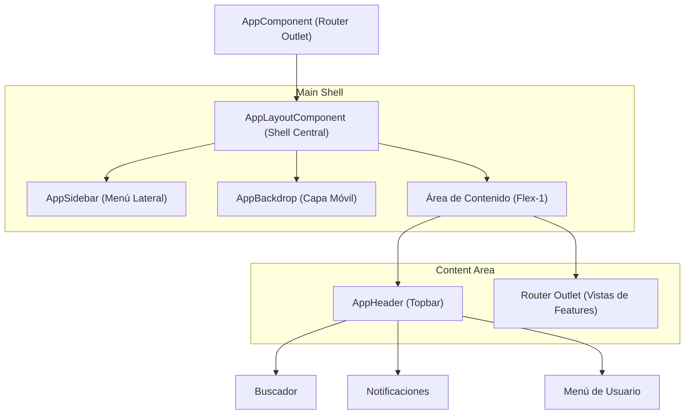
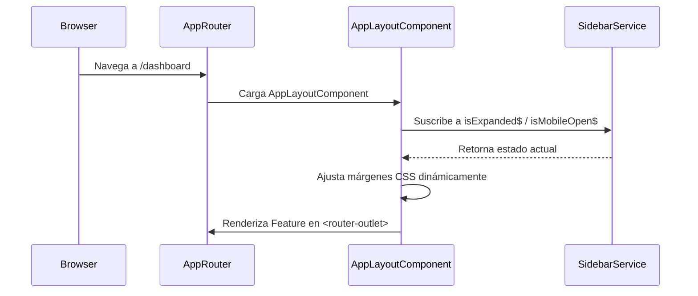

# Guía del Sistema de Layout - UyuniAdmin

Esta guía explica cómo se construye y funciona la interfaz base (template) del proyecto **UyuniAdmin**, permitiendo a los desarrolladores modificar o extender la estructura visual de manera segura.

---

## 🏗️ Esquema de Composición del Layout

El layout principal no es estático; es un sistema de componentes anidados que reaccionan al estado de la aplicación (como si el menú está expandido o colapsado).

### 🟦 Estructura de Bloques (Componentes)

---

## 🚦 Flujo de Generación y Funcionamiento

El layout se inyecta a través del ruteo principal. No es una cáscara fija en `app.component.html`, lo que permite tener diferentes layouts (ej: uno para el Dashboard y otro para el Login).

### 🔁 Diagrama de Generación

---

## 📂 Archivos y Carpetas Clave

Toda la lógica del layout reside en `src/app/shared/layout/`.

### 1. `app-layout/` (El Contenedor Maestro)
Es el orquestador. Define la estructura de alto nivel y los márgenes que dejan espacio al Sidebar.
- **[app-layout.component.html](file:///opt/uyuni/an-uyuni-frontend/src/app/shared/layout/app-layout/app-layout.component.html)**: Define el grid principal y las animaciones de transición.
- **Lógica**: Reacciona a los cambios en `SidebarService` para mover el contenido a la derecha o izquierda.

### 2. `app-sidebar/` (Navegación Lateral)
Contiene la lista de enlaces y categorías.
- **[app-sidebar.component.ts](file:///opt/uyuni/an-uyuni-frontend/src/app/shared/layout/app-sidebar/app-sidebar.component.ts)**: Aquí es donde se añaden o quitan ítems del menú principal.
- **Estado**: Se colapsa automáticamente en pantallas pequeñas.

### 3. `app-header/` (Barra Superior)
Maneja las acciones globales.
- **Funciones**: Búsqueda global, notificaciones, cambio de tema (Dark/Light) y cierre de sesión.

### 4. `auth-page-layout/` (Layout de Autenticación)
Un layout simplificado usado para las páginas de `signin` y `signup`.
- **Diferencia**: No tiene Sidebar ni Header. Es una pantalla dividida con un panel visual a la derecha.

---

## 🧠 Sincronización: `SidebarService`

Este es el archivo más importante para el funcionamiento del layout.
- **Ubicación**: `src/app/shared/services/sidebar.service.ts`
- **Función**: Utiliza **Signals** u **Observables** para que cuando el usuario haga clic en el botón de "hamburguesa" en el `Header`, el `Sidebar` se abra y el `AppLayout` ajuste los márgenes al mismo tiempo.

---

## 🛠️ Guía para Desarrolladores (Cómo Modificar)

### ¿Cómo añadir un nuevo ítem al menú?
1. Dirígete a `src/app/shared/layout/app-sidebar/app-sidebar.component.ts`.
2. Busca el array de navegación o el HTML si es estático.
3. Asegúrate de que la ruta coincida con la definida en `app.routes.ts`.

### ¿Cómo cambiar el ancho del Sidebar?
1. El ancho está definido mediante clases de **Tailwind CSS** en los componentes.
2. En `AppLayoutComponent`, ajusta las clases `xl:ml-[290px]` (expandido) o `xl:ml-[90px]` (colapsado) para que el contenido se mueva acorde al nuevo ancho.

### ¿Cómo crear un layout totalmente nuevo?
1. Crea una carpeta en `shared/layout/mi-nuevo-layout/`.
2. Crea el componente con su `<router-outlet>`.
3. En `app.routes.ts`, envuelve un grupo de rutas con este nuevo componente como `component: MiNuevoLayoutComponent`.

---
> [!TIP]
> Si deseas mejorar el rendimiento de las transiciones, asegúrate de mantener las clases `transition-all` y `duration-300` sincronizadas entre el Sidebar y el Contenedor principal.
