# Guía del Sistema de Layout - UyuniAdmin

Esta guía explica cómo se construye y funciona la interfaz base (template) del proyecto **UyuniAdmin**, permitiendo a los desarrolladores modificar o extender la estructura visual de manera segura.

---

## 🏗️ Esquema de Composición del Layout

El layout principal no es estático; es un sistema de componentes anidados que reaccionan al estado de la aplicación (como si el menú está expandido o colapsado).

### 🟦 Estructura de Bloques (Componentes)

```mermaid
graph TD
    App["AppComponent (Router Outlet)"] --> Layout["AppLayoutComponent (Shell Central)"]
    
    subgraph "Main Shell"
    Layout --> Sidebar["AppSidebar (Menú Lateral)"]
    Layout --> Backdrop["AppBackdrop (Capa Móvil)"]
    Layout --> ContentArea["Área de Contenido (Flex-1)"]
    end
    
    subgraph "Content Area"
    ContentArea --> Header["AppHeader (Topbar)"]
    ContentArea --> PageOutlet["Router Outlet (Vistas de Features)"]
    end

    Header --> RoleSelector["Selector de Rol"]
    Header --> Notifications["Notificaciones"]
    Header --> UserMenu["Menú de Usuario"]
```



---

## 🚦 Flujo de Generación y Funcionamiento

El layout se inyecta a través del ruteo principal. No es una cáscara fija en `app.component.html`, lo que permite tener diferentes layouts (ej: uno para el Dashboard y otro para el Login).

### 🔁 Diagrama de Generación

```mermaid
sequenceDiagram
    participant Browser
    participant Router as AppRouter
    participant Shell as AppLayoutComponent
    participant Service as SidebarService
    
    Browser->>Router: "Navega a /dashboard"
    Router->>Shell: "Carga AppLayoutComponent"
    Shell->>Service: "Consume isExpanded() / isMobileOpen() (Signals)"
    Service-->>Shell: "Retorna valor actual"
    Shell->>Shell: "Ajusta márgenes CSS dinámicamente"
    Shell->>Router: "Renderiza Feature en <router-outlet>"
```



---

## 📂 Archivos y Carpetas Clave

Toda la lógica del layout reside en `src/app/shared/layout/`.

```text
src/app/shared/
├── services/
│   └── sidebar.service.ts          # 🧠 Estado reactivo del Sidebar (Signals)
└── layout/
    ├── app-layout/                 # 🐚 Shell Principal
    │   ├── app-layout.component.ts
    │   └── app-layout.component.html
    ├── app-sidebar/                # 🍔 Menú Lateral Desplegable
    │   └── app-sidebar.component.ts
    ├── app-header/                 # 🔝 Barra Superior (User, Theme, Notifications)
    │   └── app-header.component.ts
    ├── backdrop/                   # 🌑 Capa oscura para móvil
    │   └── backdrop.component.ts
    └── skeleton-page/              # 💀 Carga inicial (Ver docs Loading)
        └── ui-skeleton-page.component.ts
```

### 1. `app-layout/` (El Contenedor Maestro)
Es el orquestador. Define la estructura de alto nivel y los márgenes que dejan espacio al Sidebar.
- **[app-layout.component.html](file:///opt/uyuni/an-uyuni-frontend/src/app/shared/layout/app-layout/app-layout.component.html)**: Define el grid principal y las animaciones de transición.
- **Lógica**: Reacciona a los cambios en `SidebarService` para mover el contenido a la derecha o izquierda.

### 2. `app-sidebar/` (Navegación Lateral)
Contiene la lista de enlaces y categorías.
- **[app-sidebar.component.ts](file:///opt/uyuni/an-uyuni-frontend/src/app/shared/layout/app-sidebar/app-sidebar.component.ts)**: Aquí es donde se añaden o quitan ítems del menú principal.
- **Estado**: Se colapsa automáticamente en pantallas pequeñas.

### 3. `app-header/` (Barra Superior)
Maneja las acciones globales.
- **Funciones**: Selección de rol activo, cambio de tema (Dark/Light) y cierre de sesión.

### 4. `auth/` (Layout de Autenticación - Interno)
El layout de autenticación ahora reside dentro de la feature `auth` (`src/app/features/auth/layout/`).
- **Uso**: Exclusivo para las páginas de `signin` y `signup`.
- **Diferencia**: No tiene Sidebar ni Header. Es una pantalla dividida con un panel visual a la derecha.

---

## 🧠 Sincronización: `SidebarService`

Este es el archivo más importante para el funcionamiento del layout.
- **Ubicación**: `src/app/shared/services/sidebar.service.ts`
- **Función**: Utiliza **Angular Signals** (`signal()`, `computed()`) para que cuando el usuario haga clic en el botón de "hamburguesa" en el `Header`, el `Sidebar` se abra y el `AppLayout` ajuste los márgenes al mismo tiempo sin necesidad de suscripciones manuales.

---

## 🛠️ Guía para Desarrolladores (Cómo Modificar)

### ¿Cómo añadir un nuevo ítem al menú?
1. Dirígete a `src/app/shared/layout/app-sidebar/app-sidebar.component.ts`.
2. Busca el array de navegación o el HTML si es estático.
3. Asegúrate de que la ruta coincida con la definida en `app.routes.ts`.

### ¿Cómo cambiar el ancho del Sidebar?
1. El ancho está definido mediante clases de **Tailwind CSS** en los componentes.
2. En `AppLayoutComponent`, ajusta las clases `xl:ml-[290px]` (expandido) o `xl:ml-[90px]` (colapsado) para que el contenido se mueva acorde al nuevo ancho.

### ¿Cómo crear un layout totalmente nuevo?
1. Crea una carpeta en `shared/layout/mi-nuevo-layout/`.
2. Crea el componente con su `<router-outlet>`.
3. En `app.routes.ts`, envuelve un grupo de rutas con este nuevo componente como `component: MiNuevoLayoutComponent`.

---
> [!TIP]
> Si deseas mejorar el rendimiento de las transiciones, asegúrate de mantener las clases `transition-all` y `duration-300` sincronizadas entre el Sidebar y el Contenedor principal.
