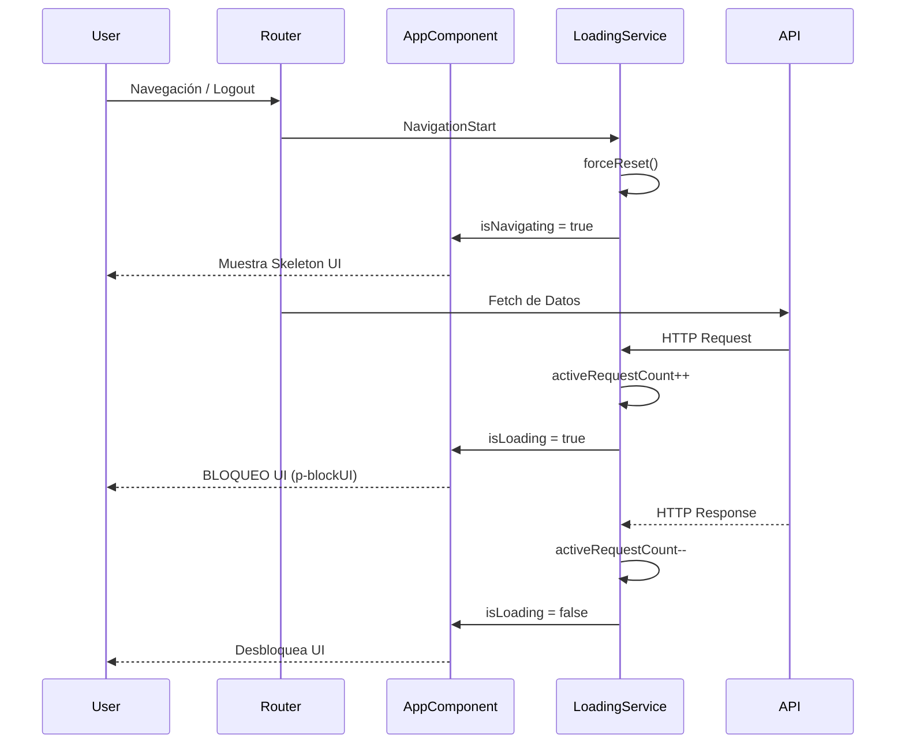

# Sistema de Carga Global y Navegación Skeleton (Gold Standard)

Este documento detalla la arquitectura, implementación y estándares del sistema de carga híbrido ("Global Loader + Skeleton Navigation") implementado en **UyuniAdmin**.

---

## 🏗️ Arquitectura de Carga Global

### 1. Truly Global Loader (Raíz)
A diferencia de implementaciones tradicionales donde el cargador vive en el layout, en **UyuniAdmin** el spinner reside en el **`AppComponent` (Root Level)**.

**Ventajas de este enfoque:**
*   **Supervivencia de Navegación**: El spinner no se destruye cuando la app cambia entre rutas públicas (`/signin`) y privadas (`/dashboard`).
*   **Gestión de Cierre de Sesión**: Garantiza que el bloqueo visual se limpie correctamente al destruir una sesión, ya que el componente raíz persiste.
*   **Unicidad**: Solo existe una instancia visual del progreso global en todo el DOM.

### 2. `LoadingService` (El Singleton)
Ubicación: `src/app/core/services/loading.service.ts`

Este servicio es el "cerebro" reactivo que gestiona el estado de carga mediante **Angular Signals**.

*   **Counter-Based Tracking**: Usamos un contador (`activeRequestCount`) para manejar peticiones simultáneas. El spinner solo desaparece cuando el contador vuelve a cero.
*   **Reset de Seguridad (NavigationStart)**: El servicio se suscribe al Router y llama a `forceReset()` en cada inicio de navegación para limpiar remanentes de la página anterior.
*   **Debounce (300ms)**: Si una petición es ultrarrápida, el spinner nunca parpadea.
*   **Fail-Safe (6s)**: Reset automático tras 6 segundos por si el servidor nunca responde.

---

## 👮‍♂️ Intercepción y Filtrado de Assets

El `LoadingInterceptor` (`src/app/core/interceptors/loading.interceptor.ts`) vigila todas las peticiones y decide cuáles deben activar el cargador global.

### 1. Filtrado Robusto con Regex
Para evitar que imágenes, fuentes o logos "peguen" el spinner en la pantalla, usamos una expresión regular avanzada:

```typescript
const assetRegex = /\.(svg|png|jpg|jpeg|gif|ico|webp|mp4|webm|css|js|json|woff2?|map|manifest)(\?.*|#.*)?$/i;
```

Esto asegura que:
*   Los logos de la Aduana (`.png`) no bloqueen la carga.
*   Las fuentes y manifiestos se ignoren.
*   Se soporten parámetros de caché (`?v=1.2`).

---

## 💀 Navegación Skeleton

Para las transiciones entre rutas, usamos **Skeleton Screens** que proporcionan feedback instantáneo.

### 1. `UiSkeletonPageComponent`
Es una plantilla "fantasma" que imita la estructura del dashboard. Se muestra automáticamente en el `AppLayout` cuando `isNavigating()` es verdadero.

### 2. Skeletons de Dominio
Implementamos skeletons específicos para datos dinamos, como el **Cargador de Roles** en la cabecera, que evita el parpadeo de datos cacheados al cambiar de perfil.

---

## 💻 Diagrama de Flujo (Mermaid)



---

**Última Actualización:** Enero 2026 (v1.2 - Truly Global Loader)
