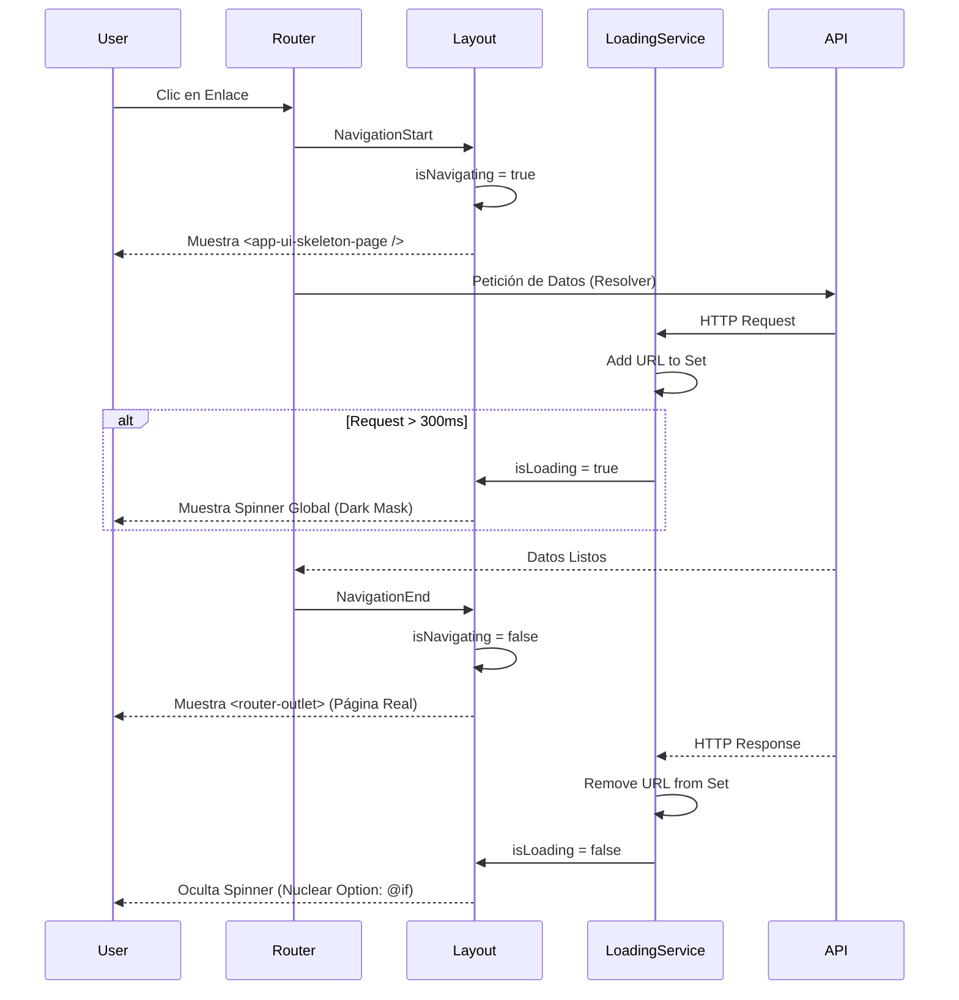

# Sistema de Carga Global y Navegación Skeleton (Gold Standard)

Este documento detalla la arquitectura, implementación y estándares del sistema de carga híbrido ("Global Loader + Skeleton Navigation") implementado en **UyuniAdmin**.

---

## 🌟 Introducción: El "Gold Standard" en UX

En el desarrollo de aplicaciones Enterprise modernas, la percepción de velocidad es tan importante como la velocidad real. Para lograr esto, hemos adoptado un enfoque híbrido que es el estándar en la industria (usado por LinkedIn, YouTube, Linear, etc.):

1.  **Skeleton Screens (Para Navegación)**:
    *   **Objetivo**: Dar feedback *instantáneo* al cambiar de ruta.
    *   **Comportamiento**: Mantiene el contexto (Sidebar y Header estáticos) y reemplaza solo el contenido central con una estructura gris "fantasma".
    *   **Por qué**: Reduce el *Layout Shift* y evita el "parpadeo blanco", haciendo que la app se sienta nativa.

2.  **Global Spinner (Para Procesos Pesados)**:
    *   **Objetivo**: Bloquear la UI durante operaciones críticas (POST, PUT, DELETE, o cargas de datos iniciales).
    *   **Comportamiento**: Oscurece la pantalla (opacidad 60%) y muestra un spinner central.
    *   **Por qué**: Evita condiciones de carrera (race conditions) y doble envíos (double submits) cuando el usuario no debe interactuar con nada más.

---

## 🏗️ Arquitectura Técnica

### 1. `LoadingService` (El Cerebro)
Ubicación: `src/app/core/services/loading.service.ts`

Este servicio es un **Singleton** que gestiona el estado de carga utilizando **Angular Signals** para máxima reactividad.

**Características Clave:**
*   **Counter-Based Tracking**: En lugar de rastrear URLs individuales, usamos un contador de peticiones activas. Esto es más robusto ante condiciones de carrera y asegura que el spinner solo se oculte cuando *todas* las peticiones han finalizado.
*   **Signals Publicos**: Exponemos `isLoading` y `isNavigating` como señales de lectura para que los componentes reaccionen sin suscripciones `rxjs`.
*   **Grace Period (Debounce)**: Las peticiones que duran menos de **300ms** se ignoran visualmente. Esto evita el "flickering" (parpadeo molesto) en conexiones rápidas.
*   **Fail-Safe Agresivo**: Un temporizador de seguridad resetea el estado si una petición se queda "colgada" por más de **6 segundos**.
*   **Tipado Estricto**: Uso de `ReturnType<typeof setTimeout>` en lugar de `any` para los timers.

### 2. `LoadingInterceptor` (El Centinela)
Ubicación: `src/app/core/interceptors/loading.interceptor.ts`

Intercepta todas las peticiones HTTP y decide si deben activar el cargador.

**Lógica de Filtrado:**
*   **Ignora Assets**: `.svg`, `.png`, `.json`, `.css`, `.js`, etc. no activan el bloqueo.
*   **Automático**: Llama a `loadingService.showLoader(url)` al iniciar y `hideLoader(url)` al finalizar (usando `finalize` de RxJS).

### 3. `AppLayoutComponent` (El Orquestador)
Ubicación: `src/app/shared/layout/app-layout/app-layout.component.ts`

Coordina la visualización basándose en el estado del Router y del Servicio.

**Ciclo de Navegación:**
1.  **NavigationStart / End / Cancel / Error**:
    *   Activa `isNavigating = true` durante el inicio y resetea al finalizar.
    *   Llama a `forceReset()` en cada uno de estos eventos para garantizar que ningún cargador "zombi" bloquee la siguiente página.
    *   Hace scroll al top (`viewportScroller`) en `NavigationEnd`.

### 📂 Estructura de Archivos

Este es el árbol de dependencias que hacen posible el sistema híbrido de carga y navegación.

```text
src/app/
├── core/
│   ├── interceptors/
│   │   └── loading.interceptor.ts      # 👮‍♂️ Interceptor HTTP (Filtra assets)
│   └── services/
│       └── loading.service.ts          # 🧠 Estado Global (Signals + Debounce)
└── shared/
    └── layout/
        ├── skeleton-page/              # 💀 Plantilla "Fantasma" del Dashboard
        └── app-layout/
            ├── app-layout.component.ts # 🎻 Orquestador (NavigationStart/End)
            └── app-layout.component.html # ☢️ "Opción Nuclear" (@if isLoading)
```

---

## 💻 Diagrama de Flujo (Mermaid)



---

## ☢️ La "Opción Nuclear" (Renderizado Condicional)

Para resolver definitivamente el problema de los "spinners pegados", implementamos una técnica de **Renderizado Condicional Estricto** en `app-layout.component.html`.

**Código:**
```html
@if (isLoading()) {
  <p-blockUI [blocked]="true">
    <!-- Spinner Content -->
  </p-blockUI>
}
```

**Explicación:**
En lugar de depender de la propiedad `[blocked]="isLoading()"` (que solo oculta CSS y a veces falla en PrimeNG al cambiar de contexto), usamos `@if (isLoading())`.
*   Esto **elimina físicamente** el componente del DOM cuando no se necesita.
*   Garantiza al 100% que la pantalla se desbloquee.

---

## 💀 Componente Skeleton (`UiSkeletonPageComponent`)
Ubicación: `src/app/shared/layout/skeleton-page/ui-skeleton-page.component.ts`

Es un componente "tonto" (Presentational) que imita la estructura genérica de nuestras páginas de Dashboard:
1.  Header (Título + Breadcrumbs + Acciones).
2.  Grid de Métricas (4 tarjetas).
3.  Tabla/Card Principal con filas simuladas.

Se usa automáticamente en el Layout cuando `isNavigating()` es verdadero.

---

## 🎭 Skeletons de Dominio (Ejemplos)

Además del skeleton de navegación global, implementamos skeletons específicos para componentes que cargan datos frescos bajo demanda:

### 1. Cambio de Rol (`Role Selection Skeleton`)
*   **Ubicación**: `AppHeaderComponent` -> Modal de Roles.
*   **Lógica**: Al abrir el modal, se activa `isLoadingRoles` en el `AuthService`.
*   **UX**: El usuario ve una lista gris animada mientras se obtienen los roles más recientes, evitando el uso de datos cacheados obsoletos.

---

## ℹ️ Guía para Desarrolladores Backend

Si eres nuevo en el equipo, esto es lo que necesitas saber:

1.  **No necesitas tocar el frontend** para que el loading funcione. Es automático para todas las peticiones HTTP.
2.  **Endpoints Lentos**: Si tu endpoint tarda más de 300ms, el usuario verá el spinner bloqueante. Intenta optimizar tus consultas.
3.  **Depuración**: Si un usuario reporta que la app se queda "pegada":
    *   Revisa si tu API está respondiendo (timeout).
    *   El frontend tiene un *Fail-Safe* de 10 segundos, pero tu API debería ser más rápida.
4.  **Race Conditions**: El frontend maneja múltiples peticiones simultáneas (ej. cargar Dashboard + cargar Notificaciones). El spinner no se irá hasta que la **última** petición termine.

---

**Última Actualización:** Enero 2026
