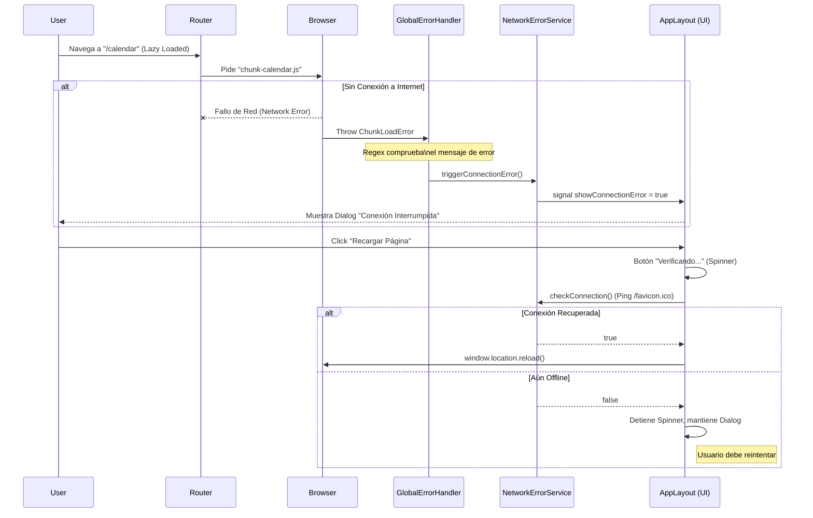

# Escudo de Resiliencia de Red (Network Resilience Shield)

## 🛡️ ¿Qué es el Escudo de Resiliencia?

El **Escudo de Resiliencia** es un mecanismo arquitectónico diseñado para proteger la aplicación de caídas de red críticas durante la navegación. En las Single Page Applications (SPAs) modernas que utilizan **Lazy Loading**, es común que un usuario pierda la conexión a internet *después* de haber cargado la aplicación inicial, pero *antes* de navegar a una nueva sección.

Cuando esto ocurre, el navegador intenta descargar el fichero `.js` (Chunk) de la nueva sección y falla.
*   **Comportamiento por defecto (Malo)**: La aplicación se queda "congelada", la URL cambia pero la vista no, o aparece la pantalla en blanco. En la consola se ve un `ChunkLoadError`.
*   **Comportamiento Uyuni "Gold Standard"**: El escudo intercepta este error específico, bloquea la interfaz amablemente e invita al usuario a recargar la página para recuperar la sincronización con el servidor.

---

## 🏛️ El Estándar y la Arquitectura

Implementamos lo que se conoce en la industria como un **"Recoverable Error Barrier"**.

### Componentes del Sistema

1.  **Interceptor Global (`GlobalErrorHandler`)**:
    *   **Ubicación**: `src/app/core/handlers/global-error-handler.ts`
    *   **Función**: Escucha *todos* los errores de tiempo de ejecución de JavaScript. Filtra específicamente aquellos que coinciden con patrones de fallo de carga de módulos (`/Loading chunk [\d]+ failed/` o `/dynamically imported module/`).
    *   **Importante**: Es el "Centinela". Si se elimina, la app volverá a crashear silenciosamente.

2.  **Servicio de Estado (`NetworkErrorService`)**:
    *   **Ubicación**: `src/app/core/services/network-error.service.ts`
    *   **Función**: Utiliza **Angular Signals** para comunicar el evento de error desde el contexto global (fuera de zona a veces) hacia la interfaz de usuario.
    *   **Zona**: Fuerza la ejecución dentro de `NgZone` para asegurar que la UI se actualice.

3.  **UI de Recuperación (`AppLayoutComponent` + `p-dialog`)**:
    *   **Ubicación**: `src/app/shared/layout/app-layout/app-layout.component.html`
    *   **Acción (Smart Reload)**: El botón "Recargar Página" primero **verificará la conexión** (ping).
        *   Si hay internet: Ejecuta `window.location.reload()`.
        *   Si no hay internet: Mantiene el Dialog y muestra estado de carga.

### Estructura de Archivos

Estos son los archivos específicos que componen la funcionalidad. **Cualquier modificación en estos rutas podría romper el escudo.**

```text
src/app/
├── app.config.ts                       # ⚠️ Registro del proveedor { ErrorHandler }
├── core/
│   ├── handlers/
│   │   └── global-error-handler.ts     # 🧠 Lógica de detección (Regex)
│   └── services/
│       └── network-error.service.ts    # 📡 Estado + Lógica de Ping (HttpClient)
└── shared/
    └── layout/
        └── app-layout/
            ├── app-layout.component.ts # 🔧 Lógica Smart Reload (checkConnection)
            └── app-layout.component.html # 🎨 UI del Dialog Modal
```

---

## 💻 Diagrama de Flujo (Mermaid)



---

## ⚠️ Guía para Desarrolladores (Do's & Don'ts)

### ❌ LO QUE NO DEBES HACER
1.  **Borrar el `GlobalErrorHandler` de `app.config.ts`**: Esto desactivará el escudo silenciosamente.
2.  **Quitar el `<p-dialog>` del `app-layout.component.html`**: El servicio activará la señal, pero el usuario nunca verá el aviso.
3.  **Cambiar las Regex**: Si modificas `/Loading chunk [\d]+ failed/`, podrías dejar de detectar errores producidos por Webpack/Vite.
4.  **Intentar cerrar el Dialog manualmente**: El estado es crítico. La única salida válida es recargar. No agregues un botón de "Cerrar" o "Cancelar".

### ✅ CÓMO PROBARLO
Como desactivar el WiFi en desarrollo local a veces es difícil de sincronizar con el Lazy Loading (porque es muy rápido), puedes simularlo así:

1.  Abre las **DevTools** del navegador (F12).
2.  Ve a la pestaña **Network**.
3.  Cambia "No throttling" a **"Offline"**.
4.  Intenta navegar a una página que **NUNCA** hayas visitado en esa sesión (para que no esté en caché).
5.  Deberías ver el Dialog inmediatamente después del error en consola.

---

## ❓ FAQ

**P: ¿Por qué no reintentamos automáticamente?**
R: Porque si el chunk falló, es probable que la conexión sea inestable. Un bucle de reintentos infinitos consume batería y datos. Es mejor pedir confirmación explícita al usuario.

**P: ¿Afecta esto al rendimiento?**
R: No. El `GlobalErrorHandler` es pasivo y solo actúa cuando ocurre una excepción. El impacto en tiempo de ejecución normal es cero.


