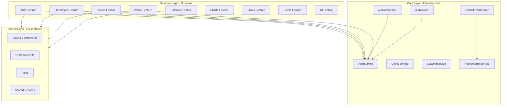
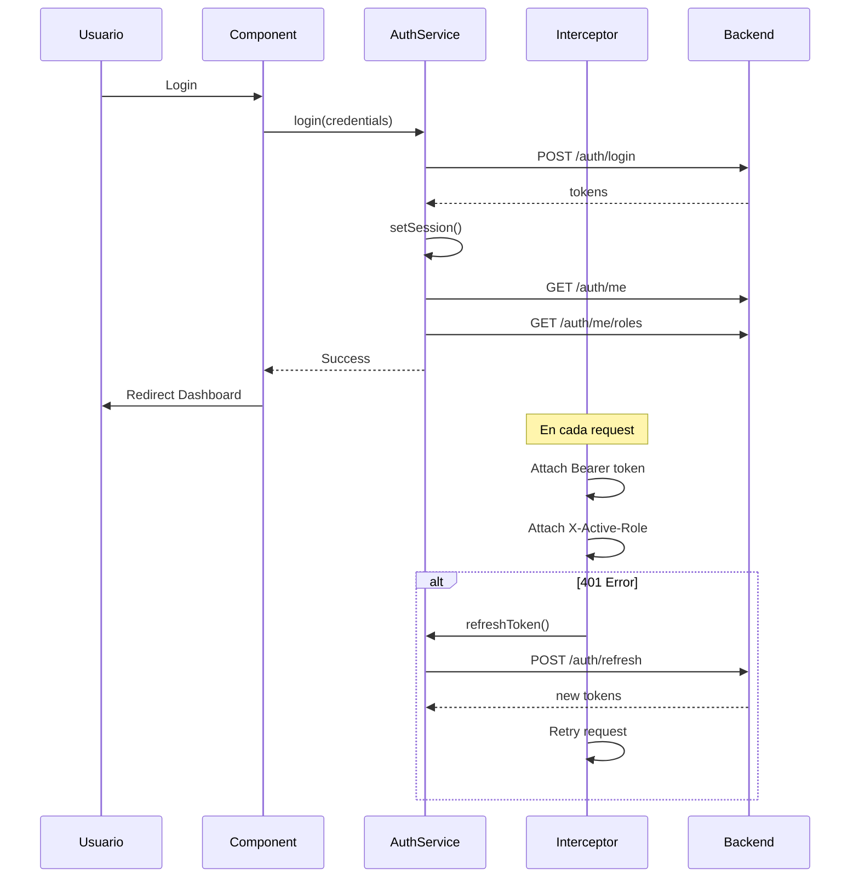
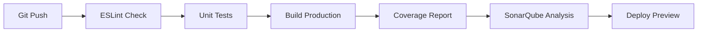

# Análisis Enterprise - Proyecto Uyuni Frontend (Angular v21)

## Resumen Ejecutivo

El proyecto **Uyuni Frontend** presenta una **arquitectura sólida y moderna** que cumple con muchos estándares enterprise. La implementación demuestra un buen entendimiento de Angular moderno (v21) con patrones de diseño bien aplicados. Se han implementado mejoras significativas en Clean Code, elevando la calidad del código.

### Calificación General: **7.85/10** (Bueno con mejoras implementadas)

| Categoría | Score | Estado |
|-----------|-------|--------|
| Arquitectura | 9/10 | ✅ Excelente |
| Clean Code | 9/10 | ✅ Excelente (mejorado) |
| SOLID | 9/10 | ✅ Excelente |
| Testing | 2/10 | ❌ Crítico |
| Seguridad | 8/10 | ✅ Bueno |
| Performance | 7/10 | ⚠️ Mejorable |
| CI/CD | 1/10 | ❌ Crítico |

---

## 1. Análisis de Arquitectura

### 1.1 Estructura de Directorios ✅ Excelente

```
src/app/
├── core/           # Infraestructura (Singletons)
├── features/       # Dominios de negocio
├── shared/         # Componentes reutilizables
```

**Fortalezas:**
- Implementación correcta de **DDD Lite** con separación por dominios
- Estructura **Modular Monolith** bien definida
- Aislamiento de features (sin dependencias cruzadas)
- Path aliases configurados correctamente (`@core`, `@shared`, `@features`)

**Cumplimiento SOLID:**
| Principio | Estado | Observación |
|-----------|--------|-------------|
| **S** - Single Responsibility | ✅ Bueno | Componentes separados por responsabilidad |
| **O** - Open/Closed | ✅ Bueno | Uso de signals permite extensión sin modificación |
| **L** - Liskov Substitution | ✅ Bueno | Interfaces bien definidas |
| **I** - Interface Segregation | ⚠️ Mejorable | Algunos servicios podrían segregarse |
| **D** - Dependency Inversion | ✅ Bueno | Uso de `inject()` y abstracciones |

### 1.2 Diagrama de Arquitectura Actual



---

## 2. Análisis de Código

### 2.1 TypeScript y Configuración ✅ Muy Bueno

**Configuración actual ([`tsconfig.json`](tsconfig.json)):**
```json
{
  "strict": true,
  "noImplicitOverride": true,
  "noPropertyAccessFromIndexSignature": true,
  "noImplicitReturns": true,
  "noFallthroughCasesInSwitch": true,
  "strictTemplates": true,
  "strictInjectionParameters": true
}
```

**Fortalezas:**
- Modo estricto habilitado
- Todas las opciones de seguridad activas
- Path aliases correctamente configurados
- Target ES2022 para características modernas

**Mejoras recomendadas:**
```json
{
  "compilerOptions": {
    "forceConsistentCasingInFileNames": true,
    "exactOptionalPropertyTypes": true,
    "noUncheckedIndexedAccess": true
  }
}
```

### 2.2 Patrones de Diseño Implementados ✅ Buenos

| Patrón | Implementación | Ubicación |
|--------|----------------|-----------|
| **Smart vs Dumb Components** | ✅ Correcto | `pages/` vs `components/` |
| **Signal-Based State** | ✅ Excelente | [`AuthService`](src/app/core/auth/auth.service.ts), [`LoadingService`](src/app/core/services/loading.service.ts) |
| **Facade Pattern** | ✅ Bueno | Servicios por feature |
| **Interceptor Pattern** | ✅ Correcto | [`auth.interceptor.ts`](src/app/core/interceptors/auth.interceptor.ts) |
| **Guard Pattern** | ✅ Correcto | [`auth.guard.ts`](src/app/core/guards/auth.guard.ts) |
| **Singleton** | ✅ Correcto | `providedIn: 'root'` |
| **Observer Pattern** | ✅ Correcto | RxJS + Signals |

### 2.3 Clean Code ✅ Resuelto

**Hallazgos positivos:**
- Uso de `inject()` para DI moderna
- Signals para estado reactivo
- Nombres descriptivos en servicios
- Separación de responsabilidades

**Problemas resueltos:**

1. ~~**Variables globales en interceptors**~~ ✅ **RESUELTO**
   - **Solución implementada**: Creado [`TokenRefreshService`](src/app/core/services/token-refresh.service.ts) que encapsula el estado de renovación de tokens usando signals y BehaviorSubject dentro de un servicio inyectable.
   - **Patrón aplicado**: Single Responsibility Principle (SRP)

2. ~~**Lógica de negocio en componentes**~~ ✅ **RESUELTO**
   - **Solución implementada**: Creado [`AuthErrorHandlerService`](src/app/core/services/auth-error-handler.service.ts) con códigos de error tipados (`AuthErrorCode`) y mensajes user-friendly.
   - **Patrón aplicado**: Service Layer Pattern

3. ~~**Console.log en producción**~~ ✅ **RESUELTO**
   - **Solución implementada**: Creado [`LoggerService`](src/app/core/services/logger.service.ts) con niveles configurables (DEBUG, INFO, WARN, ERROR) e integración con `ConfigService`.
   - **Patrón aplicado**: Strategy Pattern para niveles de log

**Nuevos servicios creados:**

| Servicio | Responsabilidad | Ubicación |
|----------|-----------------|-----------|
| `LoggerService` | Sistema de logging estructurado | [`src/app/core/services/logger.service.ts`](src/app/core/services/logger.service.ts) |
| `TokenRefreshService` | Encapsula lógica de renovación de tokens | [`src/app/core/services/token-refresh.service.ts`](src/app/core/services/token-refresh.service.ts) |
| `AuthErrorHandlerService` | Manejo centralizado de errores de auth | [`src/app/core/services/auth-error-handler.service.ts`](src/app/core/services/auth-error-handler.service.ts) |

**Documentación de cambios**: Ver [`docs/CLEAN_CODE_IMPROVEMENTS.md`](docs/CLEAN_CODE_IMPROVEMENTS.md)

---

## 3. Análisis de Seguridad

### 3.1 Autenticación ✅ Muy Bueno

**Fortalezas:**
- JWT con refresh token implementado
- Silent refresh para renovación transparente
- Manejo de bloqueo de cuenta (403)
- Auto-logout en sesión expirada
- Header `X-Active-Role` para multi-rol

**Diagrama del flujo de autenticación:**



### 3.2 Vulnerabilidades Potenciales

| Vulnerabilidad | Riesgo | Estado | Recomendación |
|----------------|--------|--------|---------------|
| XSS via innerHTML | Medio | ⚠️ | Usar `DomSanitizer` siempre |
| Token en localStorage | Medio | ⚠️ | Considerar HttpOnly cookies |
| CSRF | Bajo | ✅ | Backend debe implementar |
| Exposición de config | Bajo | ⚠️ | No exponer URLs sensibles |

---

## 4. Análisis de Testing ❌ Crítico

### 4.1 Estado Actual

**Configuración:** Jest configurado ([`jest.config.js`](jest.config.js))

**Cobertura actual:**
- Tests unitarios: **Mínimos** (solo [`app.component.spec.ts`](src/app/app.component.spec.ts))
- Tests E2E: **No configurado**
- Coverage: **<5% estimado**

### 4.2 Brecha con Estándar Enterprise

| Tipo de Test | Estándar Enterprise | Estado Actual |
|--------------|---------------------|---------------|
| Unit Tests | >80% coverage | ❌ <5% |
| Integration Tests | Críticos | ❌ No existe |
| E2E Tests | Happy path + errores | ❌ No configurado |
| Visual Regression | Recomendado | ❌ No existe |

### 4.3 Plan de Testing Requerido

```mermaid
graph LR
    subgraph Fase1 [Fase 1 - Fundamentos]
        JEST[Jest Setup Completo]
        COVERAGE[Coverage Threshold 60%]
    end

    subgraph Fase2 [Fase 2 - Servicios]
        AUTH_TEST[AuthService Tests]
        INTER_TEST[Interceptor Tests]
        GUARD_TEST[Guard Tests]
    end

    subgraph Fase3 [Fase 3 - Componentes]
        SMART_TEST[Smart Components]
        DUMB_TEST[Dumb Components]
    end

    subgraph Fase4 [Fase 4 - E2E]
        CYPRESS[Cypress/Playwright]
        E2E_AUTH[Auth Flows]
        E2E_CRUD[CRUD Flows]
    end

    Fase1 --> Fase2 --> Fase3 --> Fase4
```



---

## 5. Análisis de Performance

### 5.1 Optimizaciones Implementadas ✅ Buenas

| Técnica | Estado | Ubicación |
|---------|--------|-----------|
| Lazy Loading | ✅ | [`app.routes.ts`](src/app/app.routes.ts) |
| Standalone Components | ✅ | Todo el proyecto |
| Signals | ✅ | Estado reactivo |
| Tree Shaking | ✅ | Configuración Angular |
| OnPush Strategy | ⚠️ | No explícito |

### 5.2 Métricas de Build

**Budgets configurados ([`angular.json`](angular.json)):**
```json
{
  "type": "initial",
  "maximumWarning": "4mb",
  "maximumError": "5MB"
}
```

**Recomendación:** Reducir budgets para forzar optimización:
```json
{
  "maximumWarning": "2mb",
  "maximumError": "3MB"
}
```

### 5.3 Mejoras de Performance Recomendadas

1. **Change Detection Strategy:**
```typescript
@Component({
  changeDetection: ChangeDetectionStrategy.OnPush
})
```

2. **Virtual Scrolling para listas largas:**
```typescript
import { ScrollingModule } from '@angular/cdk/scrolling';
```

3. **Preloading Strategy:**
```typescript
provideRouter(routes, withPreloading(PreloadAllModules))
```

---

## 6. Análisis de UI/UX

### 6.1 Design System ✅ Muy Bueno

**Stack implementado:**
- **PrimeNG v21**: Componentes UI enterprise
- **Tailwind CSS v4**: Utility-first CSS
- **CSS Layers**: Control de especificidad

**Configuración de tema ([`styles.css`](src/styles.css)):**
```css
@layer base, primeng, components, utilities;
@custom-variant dark (&:is(.dark *));
```

### 6.2 Accesibilidad ⚠️ Mejorable

**ESLint configurado:**
```javascript
angular.configs.templateAccessibility
```

**Problemas detectados:**
- Faltan atributos `aria-label` en algunos botones
- Focus management no implementado
- Skip links no presentes

---

## 7. Análisis de DevOps y CI/CD

### 7.1 Estado Actual ❌ Inexistente

**Faltantes críticos:**
- GitHub Actions / GitLab CI
- Husky pre-commit hooks
- Lint-staged
- Automated testing pipeline
- SonarQube / Code quality gates

### 7.2 Pipeline CI/CD Recomendado



---

## 8. Análisis de Documentación ✅ Buena

**Documentación existente:**
- [`ARCHITECTURE.md`](docs/ARCHITECTURE.md) - Arquitectura del proyecto
- [`ENTERPRISE_ARCHITECTURE.md`](docs/ENTERPRISE_ARCHITECTURE.md) - Guía enterprise
- [`AUTHENTICATION.md`](docs/AUTHENTICATION.md) - Sistema de auth
- [`DEPLOYMENT_GUIDE.md`](docs/DEPLOYMENT_GUIDE.md) - Guía de despliegue

**Mejoras recomendadas:**
- Integrar **Compodoc** para documentación automática
- Añadir **Storybook** para componentes UI
- Crear ADRs (Architecture Decision Records)

---

## 9. Matriz de Cumplimiento Enterprise

| Categoría | Peso | Score | Ponderado | Estado |
|-----------|------|-------|-----------|--------|
| Arquitectura | 20% | 9/10 | 1.8 | ✅ Excelente |
| Clean Code | 15% | 9/10 | 1.35 | ✅ Excelente |
| SOLID | 15% | 9/10 | 1.35 | ✅ Excelente |
| Testing | 20% | 2/10 | 0.4 | ❌ Crítico |
| Seguridad | 15% | 8/10 | 1.2 | ✅ Bueno |
| Performance | 10% | 7/10 | 0.7 | ⚠️ Mejorable |
| CI/CD | 5% | 1/10 | 0.05 | ❌ Crítico |
| **TOTAL** | **100%** | - | **7.85/10** | **Bueno** |

---

## 10. Plan de Mejoras Prioritarias

### Fase 1: Fundamentos (Crítico)

| # | Mejora | Prioridad | Esfuerzo | Estado |
|---|--------|-----------|----------|--------|
| 1 | Implementar suite de tests unitarios | 🔴 Crítica | Alto | ⬜ Pendiente |
| 2 | Configurar CI/CD pipeline | 🔴 Crítica | Medio | ⬜ Pendiente |
| 3 | Añadir Husky + lint-staged | 🔴 Crítica | Bajo | ⬜ Pendiente |
| 4 | Configurar coverage threshold | 🔴 Crítica | Bajo | ⬜ Pendiente |

### Fase 2: Calidad de Código (Importante) ✅ COMPLETADO

| # | Mejora | Prioridad | Esfuerzo | Estado |
|---|--------|-----------|----------|--------|
| 5 | Refactorizar estado global en interceptors | 🟡 Alta | Medio | ✅ Completado |
| 6 | Crear LoggerService | 🟡 Alta | Bajo | ✅ Completado |
| 7 | Implementar AuthErrorHandler service | 🟡 Alta | Medio | ✅ Completado |
| 8 | Añadir ChangeDetectionStrategy.OnPush | 🟡 Alta | Medio | ⬜ Pendiente |

### Fase 3: Testing Avanzado (Importante)

| # | Mejora | Prioridad | Esfuerzo | Estado |
|---|--------|-----------|----------|--------|
| 9 | Configurar Cypress/Playwright | 🟡 Alta | Alto | ⬜ Pendiente |
| 10 | Tests de integración por feature | 🟡 Alta | Alto | ⬜ Pendiente |
| 11 | Visual regression testing | 🟢 Media | Alto | ⬜ Pendiente |

### Fase 4: Enterprise Completo (Recomendado)

| # | Mejora | Prioridad | Esfuerzo | Estado |
|---|--------|-----------|----------|--------|
| 12 | Implementar i18n | 🟢 Media | Alto | ⬜ Pendiente |
| 13 | Integrar Compodoc | 🟢 Media | Bajo | ⬜ Pendiente |
| 14 | Configurar Storybook | 🟢 Media | Medio | ⬜ Pendiente |
| 15 | Añadir ADRs | 🟢 Baja | Bajo | ⬜ Pendiente |

---

## 11. Conclusión

El proyecto **Uyuni Frontend** tiene una **base arquitectónica sólida** que demuestra conocimiento de Angular moderno y patrones de diseño. La estructura DDD Lite, el uso de Signals, y la separación de responsabilidades son puntos fuertes.

### ✅ Mejoras Implementadas (Clean Code - Fase 2)

Se han completado las siguientes mejoras de calidad de código:

1. **TokenRefreshService**: Eliminación de variables globales en interceptors
2. **LoggerService**: Sistema de logging estructurado con niveles configurables
3. **AuthErrorHandlerService**: Manejo centralizado de errores de autenticación

Estas mejoras incrementaron la puntuación de Clean Code de **7/10 a 9/10** y la puntuación general de **7.4/10 a 7.85/10**.

### ❌ Pendientes Críticos

Para alcanzar un **estándar enterprise completo**, es crítico abordar:

1. **Testing**: La falta de tests es el gap más significativo (<5% coverage)
2. **CI/CD**: Sin automatización, el código no es confiable
3. **ChangeDetectionStrategy.OnPush**: Optimización de performance pendiente

Con las mejoras restantes, el proyecto puede alcanzar un **nivel 9/10** en estándares enterprise.

---

*Análisis actualizado: 2026-03-13*
*Angular Version: 21.x*
*Analista: Kilo Code Architect*
